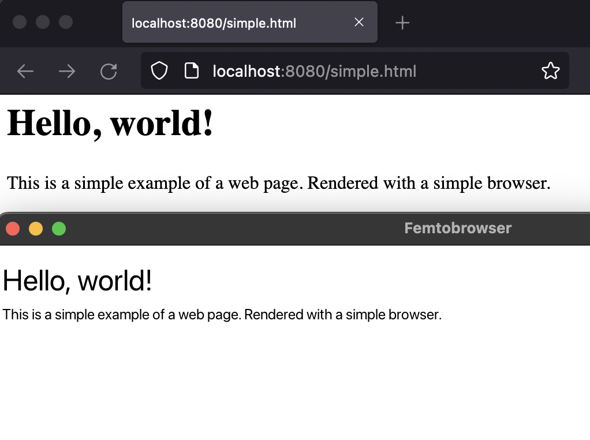

# Femtobrowser

A really basic web browser written in ~500 lines of V using only the integrated
vlib library. It was not designed to be fast or efficient, but rather to be
a simple example of how to use the vlib library to create a web browser.
**Made in few hours to mess around with V.**



I may of may not continue to work on this project, but I will try to keep it
updated with the latest V version if I can. Please note it was made in a few
hours and is not meant to be a serious project.
**IT WILL NOT RENDER A LOT OF WEBPAGES PROPERLY.**

It uses:
- gg / gx
- http.net
- http.html

It doesn't do:
- Javascript
- CSS
- Basic layout handling (The page is rendered as a single column)
- Fancy HTML elements (It will not render tables, forms, audio, images, etc.)

## Usage

```bash
$ v -skip-unused run browser <YOUR WEBSITE>
```

A simple page is included in the `examples` folder. You can use it to test the
browser.
```
$ python -m http.server 8080
$ v run browser http://localhost:8080/examples/simple.html
```

## License

This project is licensed under the GNU GPLv3 License - see the
[LICENSE](LICENSE) file for details
